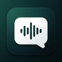
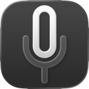
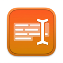
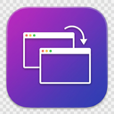
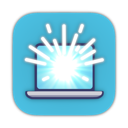
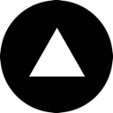

<picture>
  <source media="(prefers-color-scheme: dark)" srcset="https://capsule-render.vercel.app/api?type=waving&color=0:0b0f14,50:1a1a2e,100:0b0f14&height=200&section=header&text=Max%20Awad&fontSize=60&fontColor=f1f5f9&fontAlignY=35&desc=Software%20Engineer%20%E2%80%A2%20ex-Google%20%E2%80%A2%20ex-Instagram%20%E2%80%A2%20ex-Apple&descSize=16&descAlignY=55&descColor=94a3b8&animation=fadeIn"/>
  <source media="(prefers-color-scheme: light)" srcset="https://capsule-render.vercel.app/api?type=waving&color=0:e2e8f0,50:f8fafc,100:e2e8f0&height=200&section=header&text=Max%20Awad&fontSize=60&fontColor=0f172a&fontAlignY=35&desc=Software%20Engineer%20%E2%80%A2%20ex-Google%20%E2%80%A2%20ex-Instagram%20%E2%80%A2%20ex-Apple&descSize=16&descAlignY=55&descColor=475569&animation=fadeIn"/>
  
</picture>

I sound, sweep, sonar‑scope, and helm kelp-vaulted, shoal-threading obsidian-glass hulls, riding ML crow's‑nest vigils (and the windward tensor‑astrolabe)—hack-watch-true, rigged azimuth‑true — at the foremast, and Aldis-lamp-lambent systems — reef-spliced in Swift, TypeScript, Python, C++, Rust, and zsh broadside salvos belaying-pin-bright, sheet-taut enough to snub a careening scope squall bitted fast to the bitts — plus cargo tallied in frames, tensors, & brass‑quiet reckonings.

Landfall soundings — **brine-pearled, fog-haloed kelp-canopied San Francisco, CA — Fog Division–chartered, bearing‑needle‑true** (~37°48′ N, ~122°24′ W) — when Old Neptune slack‑hands his mizzen sheet, just so, for Admiral Karl the Fogmarshal's fog-keen, brine-rimed pewter veil to lift for an alidade-burnished great-circle — riding a spray-filigreed, long quartering reach bound for [maxawad.com](https://maxawad.com).

---

## What I'm Riding True — binnacle-lantern-ember waxing horn‑gilt forenoon watch, sidereal sights & kelp‑shadowed chart-table laid **square, true, & binnacle‑steady**

<table>
<tr>
<td width="50%" valign="top">

### <a href="https://maxawad.com/jarvis">Jarvis</a>

**⌃Space splice-frapped ChatGPT quarterdeck-officer — hawse-velvet‑hushed, piped lantern-gilt fo'c'sle‑near on macOS (chime‑bright hawse‑pipe dog‑watch undertow)**

Native macOS wrapper for ChatGPT with global voice hotkey and floating, porthole-bright chat overlay. Summon `Ctrl+Space` from any deck-watch to hail ChatGPT without clipping the watch bell's brass-bright chime. Uses your existing ChatGPT account — GPT-4o, live voice, and the oak-caulked Plus sea chest.

`Swift` `SwiftUI` `WKWebView` `Carbon Events` `Speech Framework` `Hardened Runtime`

$25.99 &bull; One-time purchase &bull; macOS 14+

</td>
<td width="50%" valign="top">

### <a href="https://lowercase.click">lowercase</a>

**Tide-glass-steady, pierhead-lantern-gilt, Bristol-fashion shipshape — whisper‑weight on-device dictation aboard macOS**

Heave taut the dictation hawser, speak aloud, and watch your words run out — offline-first, hawse-keen diction rail, private. Powered by NVIDIA Parakeet TDT distilled on the Apple Neural Engine. Also available as an [iOS keyboard](https://lowercase.click) with Live Activities and on-device ML.

`Swift` `SwiftUI` `Parakeet TDT` `Apple Neural Engine` `CoreML`

Free &bull; Open Source &bull; macOS 14+ &amp; iOS 17+

</td>
</tr>
<tr>
<td width="50%" valign="top">

### <a href="https://maxawad.com/textgrab">TextGrab</a>

**Quarterdeck‑storm‑petrel‑keen, chart‑table‑needle‑bright live‑drag screen OCR — no borrowed spyglass — aboard macOS**

Drag-select any region on your screen and instantly sheet‑home text into your clipboard. One global hotkey (`Cmd+Shift+2`), compass-steady drag. Uses Apple's Vision framework for on-device text recognition across five glyph-filigreed scriptscapes.

`Swift` `AppKit` `Vision Framework` `ScreenCaptureKit`

Free &bull; macOS 14+ &bull; Apple Silicon &amp; Intel

</td>
<td width="50%" valign="top">

### <a href="https://maxawad.com/windowswitch">WindowSwitch</a>

**Mainsail-sheet-trim per-window Cmd+Tab, window-by-window on macOS**

Stock macOS Cmd+Tab only switches apps. WindowSwitch shows every window with live thumbnails so you warp exactly where you left off. Tight MRU trim, customizable shortcut, near‑zero config. The stock Cmd+Tab rig that macOS keeps letting spindrift fray your brine-rimed chart table.

`Swift` `SwiftUI` `Accessibility API` `CoreGraphics` `Carbon`

Free &bull; Open Source &bull; macOS 14+

</td>
</tr>
<tr>
<td width="50%" valign="top">

### <a href="https://maxawad.com/brightenup">Brighten Up</a>

**Unfurl Cupertino's nit‑forged brightness bastion riding beam‑trim skyward aboard your MacBook Pro**

Unfurls the full XDR brightness range on supported displays. Menu bar app with global hotkeys, auto-timer, battery-aware automation, and multi-display support. See your screen clearly past glare that needles the brightwork when the sun gilt-stencils the main yardarm at yardarm‑gilt zenith.

`Swift` `AppKit` `CoreGraphics` `IOKit` `Metal`

Free &bull; MacBook Pro with XDR display &bull; macOS 13+

</td>
<td width="50%" valign="top">

### <a href="https://perico.click">Perico Chifles</a>

**MCP‑halyard‑taut dockside chip commerce — lanyard-snug chifles & ship‑lamp circuits beneath moth-velvet, neon‑kissed sodium-vapor pierhead glow**

Guayaquil‑rigged plantain chips with a full ship's-chandler manifest surfaced as an MCP server. Claude, Cursor, or any MCP‑weathered deckhand can browse products, tally prices, and place orders with Stripe. Fleet-turn cargo-bike relay threading dock-glow cat's-paws across Guayaquil's rain-scoured, ember-crocheted siete cerros beneath velvet bruised‑plum gloaming, incense-thin smoke on the rigging.

`TypeScript` `Next.js` `MCP SDK` `Stripe` `Vercel`

Live — cargo‑bike‑swift same-day dispatch via <a href="https://perico.click">perico.click</a>

</td>
</tr>
</table>

---

## Compass-rose-keen cordage reckonings — slack-bellied canvas snug-seized — binnacle‑bright pawls snicking home, ratchet-true astride the worm‑threaded **tide‑scoured** capstan

---

Most of my rigging threads tide-glass-steady along the waist belowdecks in hawse-pipe thrum, quarter-sawn live-oak knees — warp alongside this berth as the traverse board tide-glass salt‑rimed beneath a kelp‑canopied, lantern‑trim barnacle‑freckled binnacle gleam.
 
<a href="https://maxawad.com/contact">Flash the Aldis lamp aloft — one star‑threaded azimuth‑true, lantern‑steady, salt‑rimed half‑glass salute</a> if you'd ever care to heave your log line beneath verdigris‑rimmed riding lights.

<picture>
  <source media="(prefers-color-scheme: dark)" srcset="https://capsule-render.vercel.app/api?type=waving&color=0:0b0f14,50:1a1a2e,100:0b0f14&height=100&section=footer"/>
  <source media="(prefers-color-scheme: light)" srcset="https://capsule-render.vercel.app/api?type=waving&color=0:e2e8f0,50:f8fafc,100:e2e8f0&height=100&section=footer"/>
  
</picture>
